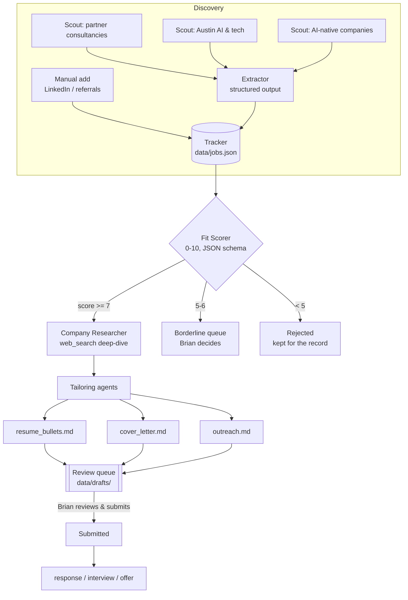

# JobOps — a multi-agent job-search orchestrator built on Claude

A hub-and-spoke agent system that finds AI-architect job openings, scores
them against a candidate profile, researches the companies, and drafts
tailored application materials — **with a human making every submission**.

Built by [Brian Bruner](mailto:brian@brunermedia.com) as both a working job-search
tool and a demonstration of Claude orchestration patterns (agentic pipelines,
prerequisite gates, structured outputs, server-side tools, human-in-the-loop
trust boundaries).

## Architecture



Key design decisions:

- **Prerequisite gate.** Research and drafting are expensive (web searches,
  long generations). The cheap scorer runs first and gates them — only
  qualified jobs (score ≥ 7) consume the expensive pipeline.
- **Structured outputs everywhere data crosses an agent boundary.** Scout
  reports are free text; the moment they enter the tracker they pass through
  a JSON-schema extraction. The scorer's verdict is schema-constrained too —
  no regex parsing, no malformed handoffs.
- **Human-in-the-loop trust boundary.** No agent submits anything. Drafts
  land in a review queue; the human is the only actor with "send" authority.
  This is deliberate: auto-apply bots violate job-board ToS and produce
  worse interview rates than reviewed, tailored applications.
- **Checkpointed state.** The tracker saves after every expensive step, so
  an interrupted run resumes where it left off instead of re-paying for work.

## Usage

```bash
python -m jobops scout      # discovery agents search the web for openings
python -m jobops add ...    # paste in a LinkedIn posting by hand
python -m jobops process    # score → gate → research → draft (batched)
python -m jobops status     # pipeline dashboard
python -m jobops mark ID submitted   # record what YOU did
```

## Setup

```bash
python3 -m venv .venv && .venv/bin/pip install -r requirements.txt
echo "ANTHROPIC_API_KEY=sk-ant-..." > .env
cp profile/TEMPLATE_master_profile.md profile/master_profile.md  # then fill it in
.venv/bin/python -m jobops selftest
```

Personal data (`profile/master_profile.md`, `data/`, `.env`) is gitignored —
the repo is safe to publish; the job search stays private.

## Stack

Python · Anthropic SDK · `claude-sonnet-4-6` (per-agent overridable via
`JOBOPS_MODEL`) · server-side `web_search` tool · structured outputs
(`output_config.format`)

See [ARCHITECTURE.md](ARCHITECTURE.md) for the pattern-by-pattern design notes.
