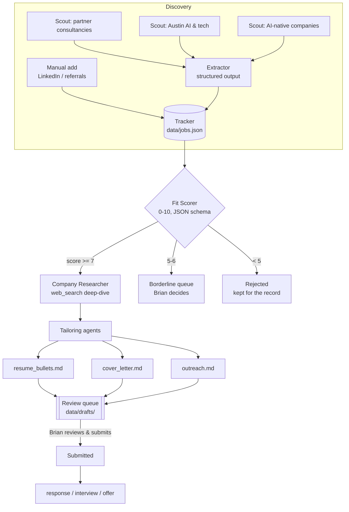

# JobOps — a multi-agent job-search orchestrator built on Claude

A hub-and-spoke agent system that finds AI-architect job openings, scores
them against a candidate profile, researches the companies, and drafts
tailored application materials — **with a human making every submission**.

Built by [Brian Bruner](mailto:brian@brunermedia.com) as both a working job-search
tool and a demonstration of Claude orchestration patterns (agentic pipelines,
prerequisite gates, structured outputs, server-side tools, human-in-the-loop
trust boundaries).

## Architecture



Key design decisions:

- **Prerequisite gate.** Research and drafting are expensive (web searches,
  long generations). The cheap scorer runs first and gates them — only
  qualified jobs (score ≥ 7) consume the expensive pipeline.
- **Structured outputs everywhere data crosses an agent boundary.** Scout
  reports are free text; the moment they enter the tracker they pass through
  a JSON-schema extraction. The scorer's verdict is schema-constrained too —
  no regex parsing, no malformed handoffs.
- **Human-in-the-loop trust boundary.** No agent submits anything. Drafts
  land in a review queue; the human is the only actor with "send" authority.
  This is deliberate: auto-apply bots violate job-board ToS and produce
  worse interview rates than reviewed, tailored applications.
- **Checkpointed state.** The tracker saves after every expensive step, so
  an interrupted run resumes where it left off instead of re-paying for work.

## Usage

```bash
python -m jobops scout      # discovery agents search the web for openings
python -m jobops add ...    # paste in a LinkedIn posting by hand
python -m jobops process    # score → gate → research → draft (batched)
python -m jobops status     # pipeline dashboard (terminal)
python -m jobops dashboard  # web cockpit: live kanban, draft viewer, run buttons
python -m jobops mark ID submitted   # record what YOU did
```

The cockpit (`http://127.0.0.1:8765`, localhost-only) polls the same
`data/jobs.json` the agents write, so a running pipeline animates live:
jobs flash as they pass the gate, drafts appear for review, and outcome
buttons record what the human did. It launches runs but submits nothing —
the trust boundary holds at every surface.

## Two run surfaces, one state

The same pipeline runs two ways, sharing `data/jobs.json` and all config:

| Surface | How | Billing | Use case |
|---|---|---|---|
| **Claude API** (`jobops/` Python) | `python -m jobops ...` | API tokens (~cents/run) | Portfolio reference implementation: server-side `web_search`, schema-enforced structured outputs, code-controlled gating |
| **Claude Code harness** (`.claude/skills/`) | `/jobops-daily` inside Claude Code, or headless `claude -p "/jobops-daily"` | Claude subscription | Daily driver — scheduled via launchd/cron at 8 AM to catch new postings the morning they appear |

The skill (`.claude/skills/jobops-daily/SKILL.md`) encodes the identical
pipeline contract — same job schema, same 0-10 scoring rubric, same gates,
same hard rule that only a human submits. Comparing the two files is a study
in the same orchestration design expressed as code vs. as harness
instructions.

Daily automation (macOS): a launchd agent runs the headless command every
morning; see `docs/scheduling.md` for the plist.

## Setup

```bash
python3 -m venv .venv && .venv/bin/pip install -r requirements.txt
echo "ANTHROPIC_API_KEY=sk-ant-..." > .env
cp profile/TEMPLATE_master_profile.md profile/master_profile.md  # then fill it in
.venv/bin/python -m jobops selftest
```

Better onboarding: open the repo in Claude Code and run `/jobops-intake` —
a guided interview (seven short phases, resumable) that builds the profile,
a verified-facts ledger (`facts.yaml`: every number tagged
documented/estimated/guess), and a contacts mini-CRM for you.

Personal data (`profile/master_profile.md`, `profile/facts.yaml`,
`profile/contacts.json`, `data/`, `.env`) is gitignored — the repo is safe
to publish; the job search stays private.

## Stack

Python · Anthropic SDK · `claude-sonnet-5` default (switch to
`claude-opus-4-8` via `JOBOPS_MODEL` or the cockpit's model picker) ·
server-side `web_search` tool · structured outputs (`output_config.format`)

See [ARCHITECTURE.md](ARCHITECTURE.md) for the pattern-by-pattern design notes.
